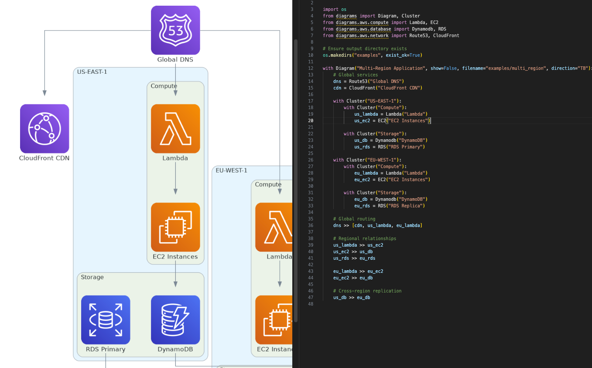

# 🔥 CloudForge

**AI-Powered AWS Architecture Diagrams with Natural Language Processing, Validation & Persistence**

[](https://www.python.org)
[](https://www.docker.com)
[](https://python.langchain.com)
[](https://streamlit.io)
[](https://fastapi.tiangolo.com)
[](LICENSE)

CloudForge is an AI-powered platform that generates **professional AWS architecture diagrams from natural language descriptions**. Simply describe your architecture, and CloudForge creates production-ready diagrams with visual styling, validation, and persistence.

## ✨ Key Features

### 🤖 Natural Language Processing
- **Describe in plain English**: "Production SaaS with Lambda, RDS, CloudFront CDN"
- **LangChain + Gemini AI**: Advanced NLP pipeline with auto-retry and structured output
- **LangGraph Orchestration**: State machine for reliable multi-step generation
- **Blueprint Generation**: Extracts services, relationships, and architecture patterns

### 🎨 Professional Diagrams
- **Auto-Generated Visuals**: Color-coded by environment (production=red, staging=orange, dev=blue)
- **Organized Clusters**: Services grouped by category (Compute, Database, Network, Storage)
- **Edge Labels**: Connection types automatically labeled (triggers, reads_writes, forwards)
- **Multiple Formats**: PNG, PDF, SVG output
- **Production-Ready**: Publication quality with GraphViz rendering

### ✓ Intelligent Validation
- **Python AST Parsing**: Syntax validation of generated code
- **Security Scanning**: Detects dangerous functions and patterns
- **Component Whitelisting**: Validates 50+ AWS services
- **Relationship Analysis**: Ensures logical architecture patterns
- **Comprehensive Reporting**: Errors, warnings, and component metrics

### 💾 Persistent Storage
- **Diagram Management**: Save, retrieve, and organize diagrams
- **Metadata Tracking**: Created date, tags, environment, service categories
- **SHA256 Verification**: File integrity checking
- **JSON Indexing**: Fast retrieval and filtering
- **Full CRUD Operations**: List, get, delete diagrams

### 🚀 Full-Stack Architecture
- **FastAPI Backend**: REST API for diagram generation and management
- **Streamlit Web UI**: Interactive interface for end users
- **Docker Compose**: Complete local development and deployment
- **LangChain Chains**: Specialized processing for blueprint and code generation
- **Environment Detection**: Automatic production/staging/dev classification

## 🚀 Quick Start

### Prerequisites

- Python 3.12+
- GraphViz (for diagram rendering)
- Docker & Docker Compose (recommended)
- Google API Key (for Gemini AI) - get it at https://ai.google.dev

### Option 1: Docker Compose (Recommended)

**Fastest way to get started:**

```bash
# Set API key
echo "GOOGLE_API_KEY=your_api_key_here" > .env

# Build and start services
make build
make up

# Access the UI
# Web UI: http://localhost:8501
# API Docs: http://localhost:8000/docs
```

**Stop services:**
```bash
make down
```

### Option 2: Local Development

```bash
# Install GraphViz
brew install graphviz          # macOS
# sudo apt install graphviz    # Ubuntu/Debian

# Install UV package manager
curl -LsSf https://astral.sh/uv/install.sh | sh

# Clone and setup
cd /path/to/mcp-aws
uv pip install -e .

# Set API key
export GOOGLE_API_KEY="your_api_key_here"

# Run API server
uvicorn src.api:app --host 0.0.0.0 --port 8000

# In another terminal, run Streamlit UI
streamlit run ui/app.py --server.port 8501
```

### Option 3: Docker Direct

```bash
# Build image
docker build -t cloudforge:latest .

# Run container with API key
docker run -e GOOGLE_API_KEY="your_key" -p 8000:8000 cloudforge:latest
```

## 📖 How It Works

### Architecture Pipeline

```
User Input (Natural Language)
         ↓
[1] BlueprintArchitectChain (LangChain + Gemini)
    - Analyzes description
    - Extracts services, relationships
    - Generates structured JSON blueprint
         ↓
[2] DiagramCoderChain (LangChain + Gemini)
    - Converts blueprint to Python code
    - Adds colors, clusters, styling
    - Generates production-ready code
         ↓
[3] Validator (AST Parser)
    - Checks syntax validity
    - Validates AWS components
    - Performs security scanning
         ↓
[4] DiagramGenerator (GraphViz)
    - Executes Python code
    - Generates PNG/PDF/SVG images
    - Stores outputs
         ↓
[5] Storage Layer (JSON + Files)
    - Persists diagrams and metadata
    - Enables retrieval and management
```

### Complete Workflow

```
Streamlit Web UI (http://localhost:8501)
         ↓
FastAPI Backend (http://localhost:8000)
         ↓
LangGraph Pipeline (LangChain orchestration)
         ↓
Generated Diagram PNG/PDF/SVG
         ↓
Browser Display + Storage
```

## 📖 Usage Guide

### 1. Generate Diagram from Natural Language (Web UI)

Open http://localhost:8501 and describe your architecture:

```
"Production microservices with API Gateway, Lambda,
RDS database, and CloudFront CDN for static assets"
```

CloudForge automatically:
- 🤖 Parses your description
- 🎨 Generates color-coded diagram
- ✓ Validates all components
- 📊 Displays PNG with edge labels
- 💾 Stores for future reference

### 2. Generate via REST API

```bash
curl -X POST http://localhost:8000/v1/diagrams/generate \
  -H "Content-Type: application/json" \
  -d '{
    "description": "Serverless API with Lambda and DynamoDB",
    "name": "serverless_api"
  }'
```

**Response:**
```json
{
  "success": true,
  "blueprint": {
    "title": "Serverless REST API",
    "nodes": [...],
    "relationships": [...]
  },
  "code": "import os\nfrom diagrams import...",
  "validation": {
    "is_valid": true,
    "component_count": 3,
    "relationship_count": 2,
    "errors": [],
    "warnings": []
  },
  "output_files": {
    "png": "/app/diagrams/serverless_api.png"
  }
}
```

### 3. Validation Details

Each diagram includes comprehensive validation:

- **Syntax**: Valid Python code
- **Components**: AWS services exist and are properly imported
- **Security**: No dangerous functions (exec, eval, __import__)
- **Limits**: Respects max components/relationships
- **Relationships**: Logical architecture patterns

### 4. Visual Features

Generated diagrams include:

- **Color Coding**:
  - Red (#E74C3C) for Production
  - Orange (#F39C12) for Staging
  - Blue (#3498DB) for Development

- **Clusters**: Services organized by category
  - Network, Compute, Database, Storage, Integration

- **Edge Labels**: Connection types labeled
  - "forwards" (load balancing)
  - "triggers" (event-driven)
  - "reads_writes" (database access)
  - "pulls" (data retrieval)

### 5. Manage Diagrams

**List diagrams:**
```bash
curl http://localhost:8000/v1/diagrams
```

**Get specific diagram:**
```bash
curl http://localhost:8000/v1/diagrams/{diagram_id}
```

**Delete diagram:**
```bash
curl -X DELETE http://localhost:8000/v1/diagrams/{diagram_id}
```

**Serve image:**
```
http://localhost:8000/images/{filename.png}
```

### 6. Storage Structure

Diagrams are stored in:
```
~/.aws_diagrams/
├── {diagram_name}.png          # Generated image
├── {diagram_name}.pdf          # PDF version
├── {diagram_name}.svg          # SVG version
├── {diagram_name}_script.py    # Generated Python code
└── metadata/                   # Diagram metadata
```

## ⚙️ Configuration

### Environment Variables

```bash
# Storage path
AWS_DIAGRAM_DIAGRAMS_STORAGE_PATH=/custom/path

# Max file size (MB)
AWS_DIAGRAM_MAX_DIAGRAM_SIZE_MB=100

# Output formats
AWS_DIAGRAM_OUTPUT_FORMATS=png,pdf,svg

# Validation limits
AWS_DIAGRAM_MAX_COMPONENTS=100
AWS_DIAGRAM_MAX_RELATIONSHIPS=200

# Logging level
AWS_DIAGRAM_LOG_LEVEL=INFO
```

### Configuration File

Create `~/.aws_diagrams/config.yaml`:

```yaml
storage:
  path: ~/.aws_diagrams
  max_size_mb: 50

validation:
  enabled: true
  max_components: 100
  max_relationships: 200

output:
  formats:
    - png
    - pdf
    - svg
```

## 🔌 MCP Tools

### 1. `generate_diagram`

Generate an AWS architecture diagram from Python code.

**Parameters:**
- `code` (string, required): Python code using diagrams DSL
- `name` (string, required): Diagram name
- `description` (string, optional): Diagram description
- `validate` (boolean, optional): Validate before generating (default: true)

**Response:**
```json
{
  "success": true,
  "message": "Diagram generated successfully",
  "output_files": {
    "png": "/path/to/diagram.png",
    "pdf": "/path/to/diagram.pdf"
  }
}
```

### 2. `validate_diagram`

Validate diagram code without generating output.

**Parameters:**
- `code` (string, required): Python code to validate

**Response:**
```json
{
  "is_valid": true,
  "component_count": 5,
  "relationship_count": 4,
  "errors": [],
  "warnings": []
}
```

### 3. `list_diagrams`

List all saved diagrams.

**Parameters:**
- `tag` (string, optional): Filter by tag

### 4. `get_diagram`

Get specific diagram details.

**Parameters:**
- `diagram_id` (string, required): Diagram ID

### 5. `delete_diagram`

Delete a saved diagram.

**Parameters:**
- `diagram_id` (string, required): Diagram ID to delete

## 📚 Examples

### Example 1: Natural Language to Diagram (Recommended)

**Via Streamlit Web UI:**
1. Open http://localhost:8501
2. Enter description:
   ```
   Production e-commerce platform with CloudFront CDN,
   ALB load balancer, Lambda microservices, RDS PostgreSQL,
   and S3 for product images
   ```
3. Click "Generate Architecture"
4. View color-coded diagram with automatic clusters and labels

**Via REST API:**
```bash
curl -X POST http://localhost:8000/v1/diagrams/generate \
  -H "Content-Type: application/json" \
  -d '{
    "description": "Production e-commerce with CloudFront, ALB, Lambda, RDS, S3",
    "name": "ecommerce_prod"
  }'
```

### Example 2: Serverless Backend with Natural Language

**Describe:**
```
"Production serverless API using API Gateway,
Lambda functions, DynamoDB for data storage,
and SQS for async job processing"
```

**Generated diagram includes:**
- ✅ Color-coded clusters (Network, Compute, Database, Integration)
- ✅ Automatic edge labels (triggers, reads_writes, etc.)
- ✅ Validation report (component count, relationships)
- ✅ PNG/PDF/SVG outputs
- ✅ Full validation (syntax, security, limits)

### Example 3: Multi-Tier Application

**Describe:**
```
"Production multi-tier SaaS with Route53 for DNS,
CloudFront CDN, ALB in public subnet,
ECS microservices in private subnet,
RDS Multi-AZ primary and replica databases"
```

**Generated code example:**
```python
import os
from diagrams import Diagram, Cluster, Edge
from diagrams.aws.network import Route53, CloudFront, ALB
from diagrams.aws.compute import ECS
from diagrams.aws.database import RDS

COLOR_PROD = "#E74C3C"
COLOR_NETWORK = "#3498DB"
COLOR_COMPUTE = "#F39C12"
COLOR_DATABASE = "#27AE60"

with Diagram("Multi-tier SaaS", show=False, direction="TB"):
    with Cluster("DNS & CDN", graph_attr={"bgcolor": f"{COLOR_NETWORK}10"}):
        dns = Route53("Route53")
        cdn = CloudFront("CloudFront")

    with Cluster("Load Balancing", graph_attr={"bgcolor": f"{COLOR_NETWORK}10"}):
        lb = ALB("ALB")

    with Cluster("Compute", graph_attr={"bgcolor": f"{COLOR_COMPUTE}10"}):
        svc = ECS("Microservices")

    with Cluster("Database", graph_attr={"bgcolor": f"{COLOR_DATABASE}10"}):
        primary = RDS("Primary DB")
        replica = RDS("Replica DB")

    dns >> Edge(label="routes") >> cdn
    cdn >> lb >> svc
    svc >> Edge(label="reads_writes") >> primary
    primary >> Edge(label="replicates") >> replica
```

### Example 3: Multi-Region Architecture



```python
import os
from diagrams import Diagram, Cluster
from diagrams.aws.compute import Lambda, EC2
from diagrams.aws.database import Dynamodb, RDS
from diagrams.aws.network import Route53, CloudFront

os.makedirs("examples", exist_ok=True)

with Diagram(
    "Multi-Region Application",
    show=False,
    filename="examples/multi_region",
    direction="TB"
):
    # Global services
    dns = Route53("Global DNS")
    cdn = CloudFront("CloudFront CDN")

    # US-EAST-1 Region
    with Cluster("US-EAST-1"):
        with Cluster("Compute"):
            us_lambda = Lambda("Lambda")
            us_ec2 = EC2("EC2 Instances")

        with Cluster("Storage"):
            us_db = Dynamodb("DynamoDB")
            us_rds = RDS("RDS Primary")

    # EU-WEST-1 Region
    with Cluster("EU-WEST-1"):
        with Cluster("Compute"):
            eu_lambda = Lambda("Lambda")
            eu_ec2 = EC2("EC2 Instances")

        with Cluster("Storage"):
            eu_db = Dynamodb("DynamoDB")
            eu_rds = RDS("RDS Replica")

    # Global routing
    dns >> [cdn, us_lambda, eu_lambda]

    # Regional relationships
    us_lambda >> us_ec2
    us_ec2 >> us_db
    us_rds >> eu_rds

    eu_lambda >> eu_ec2
    eu_ec2 >> eu_db

    # Cross-region replication
    us_db >> eu_db

print("✅ Diagram generated: examples/multi_region.png")
```

**Run the example:**

```bash
# Locally
python examples/multi_region.py

# Docker
docker run -v $(pwd)/examples:/app/examples cloudforge:latest \
  python examples/multi_region.py
```

## 🏗️ Environment Setup

### Development Installation

```bash
# Install development dependencies
uv pip install -e ".[dev]"

# Verify installation
python -c "import src; print(f'CloudForge v{src.__version__}')"
```

### Project Structure

```
cloudforge/
├── src/
│   ├── __init__.py                          # Package metadata
│   ├── api.py                               # FastAPI REST server
│   ├── api_models.py                        # Pydantic API models
│   ├── server.py                            # MCP server
│   │
│   ├── infrastructure/
│   │   ├── config.py                        # Configuration management
│   │   ├── langchain_chains.py              # BlueprintArchitectChain, DiagramCoderChain
│   │   ├── langgraph_pipeline.py            # LangGraph orchestration
│   │   ├── validator.py                     # AST validation + security scanning
│   │   ├── generator.py                     # Diagram generation engine
│   │   ├── storage.py                       # Persistent storage layer
│   │   └── natural_language.py              # NLP processing utilities
│   │
│   └── domain/
│       └── models.py                        # Core domain models

├── ui/
│   ├── app.py                               # Streamlit web UI
│   ├── api_client.py                        # HTTP client for API
│   └── utils.py                             # UI utilities

├── docker-compose.yml                       # Multi-container orchestration
├── Dockerfile.api                           # API container
├── Dockerfile.ui                            # UI container
├── Makefile                                 # Convenience commands
├── .env.example                             # Environment variables
├── README.DOCKER.md                         # Docker setup guide
├── LANGCHAIN_LANGGRAPH_MIGRATION.md        # Architecture documentation
├── DOCKER_MIGRATION.md                      # Docker migration notes
├── NATURAL_LANGUAGE.md                      # NLP pipeline docs
├── pyproject.toml                           # Project metadata
├── uv.lock                                  # Dependency lock file
└── README.md                                # This file
```

### Key Components

- **API (`src/api.py`)**: FastAPI server with `/v1/diagrams/generate` endpoint
- **LangChain Chains**: Blueprint architect and diagram coder with auto-retry
- **LangGraph Pipeline**: Orchestrates multi-step generation with state management
- **Validator**: AST parsing, security scanning, component validation
- **Generator**: Executes code, produces PNG/PDF/SVG
- **Storage**: Persists diagrams with metadata and SHA256 checksums
- **Streamlit UI**: Interactive web interface for end users
- **Docker Compose**: Full local development environment

## 🧪 Testing

### Run All Tests

```bash
# Execute all tests
pytest -xvs tests/

# Run with coverage
pytest --cov=src --cov-report=html tests/

# Run specific test file
pytest -xvs tests/test_validator.py
pytest -xvs tests/test_storage.py
```

### Test Coverage

```bash
# Generate HTML coverage report
pytest --cov=src --cov-report=html tests/

# View coverage
open htmlcov/index.html
```

### Code Quality

```bash
# Format with Black
black src/ tests/

# Lint with Ruff
ruff check src/ tests/

# Type checking with mypy
mypy src/
```

## 📋 Supported AWS Components

### Compute
- `Lambda` - AWS Lambda
- `EC2` - Amazon EC2
- `ECS` - Amazon ECS
- `EKS` - Amazon EKS
- `AutoScaling` - Auto Scaling

### Networking
- `APIGateway` - API Gateway
- `Route53` - Route 53
- `CloudFront` - CloudFront CDN
- `VPC` - VPC
- `SecurityGroup` - Security Groups
- `ELB`, `ALB`, `NLB` - Load Balancers

### Storage
- `S3` - Amazon S3
- `Dynamodb` - DynamoDB
- `RDS` - RDS Database
- `ElastiCache` - ElastiCache

### Integration
- `SQS` - SQS Queue
- `SNS` - SNS Topic
- `CodePipeline` - CodePipeline
- `CodeBuild` - CodeBuild
- `CodeDeploy` - CodeDeploy

### Management
- `CloudWatch` - CloudWatch
- `IAM` - IAM
- `KMS` - KMS

## 🔧 Troubleshooting

### "GraphViz not found"

```bash
# macOS
brew install graphviz

# Linux (Ubuntu/Debian)
sudo apt-get install graphviz

# Linux (Fedora)
sudo dnf install graphviz

# Windows (Chocolatey)
choco install graphviz
```

### "Module not found: diagrams"

```bash
uv pip install diagrams
```

### Validation fails with valid components

Verify you're using exact component names and correct import paths:

```python
# ✓ Correct
from diagrams.aws.compute import Lambda

# ✗ Incorrect
from diagrams.aws.compute import lambda
```

### Docker build issues

```bash
# Clean rebuild
docker build --no-cache -t cloudforge:latest .

# Check image size
docker images cloudforge:latest
```

## 🤝 Contributing

Contributions are welcome! Please follow these steps:

1. **Fork** the repository
2. **Create** a feature branch (`git checkout -b feature/AmazingFeature`)
3. **Commit** your changes (`git commit -m 'Add AmazingFeature'`)
4. **Push** to the branch (`git push origin feature/AmazingFeature`)
5. **Open** a Pull Request

### Contributing Guidelines

- Follow PEP 8 style guide
- Write tests for new features
- Update documentation
- Keep commits atomic and descriptive

## 📝 Changelog

### v0.1.0 (2026-01-16)

**✨ Features:**
- Initial release
- AWS architecture diagram generation
- Intelligent diagram validation with security analysis
- Persistent storage with metadata management
- Complete MCP API implementation
- Multi-account architecture support
- 5 ready-to-use examples

**🔧 Technical:**
- FastMCP server implementation
- Pydantic data validation
- Dockerfile with Python 3.12-slim
- UV package manager integration
- Comprehensive test coverage
- SHA256 checksum verification

**📦 Components:**
- Validator module with AST parsing
- Generator module with subprocess execution
- Storage module with JSON indexing
- Server module with 5 MCP tools

## 🗺️ Roadmap

### Phase 1: Core Features (Completed)
- [x] Diagram generation from Python code
- [x] Validation with security scanning
- [x] Persistent storage with metadata
- [x] MCP server implementation
- [x] Docker support with UV

### Phase 2: Enhancements (In Progress)
- [ ] Support for additional diagram types (Sequence, Flow, Class)
- [ ] Terraform code generation from diagrams
- [ ] AWS CLI integration
- [ ] Web UI for visualization
- [ ] Real-time collaboration features

### Phase 3: Advanced Features (Planned)
- [ ] Git integration for version control
- [ ] AI-powered architecture suggestions
- [ ] Cost estimation from diagrams
- [ ] Security posture analysis
- [ ] Architecture compliance checking

### Phase 4: Integration (Future)
- [ ] CloudFormation template generation
- [ ] Terraform module creation
- [ ] Ansible playbook generation
- [ ] Kubernetes manifest generation

## 💬 Support

### Getting Help

- **Documentation**: See [CLOUDFORGE.md](CLOUDFORGE.md) for comprehensive documentation
- **Issues**: Report bugs on [GitHub Issues](https://github.com/your-repo/issues)
- **Discussions**: Start a discussion on [GitHub Discussions](https://github.com/your-repo/discussions)
- **Email**: contact@cloudforge.dev

### FAQ

**Q: Can I use CloudForge for production diagrams?**
A: Yes! CloudForge generates publication-ready diagrams with multiple output formats.

**Q: What's the maximum diagram complexity?**
A: Default limit is 100 components and 200 relationships (configurable).

**Q: Does CloudForge support custom AWS components?**
A: Currently supports 50+ official AWS components. Custom components coming soon.

**Q: Can I export diagrams as IaC?**
A: Terraform export is on the roadmap for Phase 2.

## 📄 License

This project is licensed under the MIT License - see [LICENSE](LICENSE) for details.

## 🙏 Acknowledgments

- Built with [Diagrams](https://diagrams.mingrammer.com/)
- Powered by [Model Context Protocol](https://modelcontextprotocol.io)
- Uses [FastMCP](https://github.com/modelcontextprotocol/python-sdk)
- Package management by [UV](https://astral.sh/uv/)

---

**CloudForge** - Forge your cloud architecture with AI ⚡

[](https://github.com/your-repo)
[](https://twitter.com/cloudforge_dev)
