# AWS Architecture Pattern Catalog

This file defines the architecture patterns recognized by the `AwsPatternSkillChain`.
Each pattern includes keywords for detection, core AWS services, key data flows (with Mermaid diagrams), and constraints.

Edit this file to add new patterns or update service recommendations — no code changes required.

---

## RAG / Semantic Search

**Keywords:** RAG, semantic search, vector, embeddings, knowledge base, Q&A over docs, retrieval, similarity search

**Core services:**
- Amazon Bedrock (Titan Embeddings + LLM): generates text embeddings and runs LLM inference
- Amazon OpenSearch Service (k-NN vector store): stores and queries embedding vectors
- Amazon S3 (document storage): stores raw documents feeding the ingestion pipeline
- AWS Lambda (orchestration): runs ingestion (S3 → Bedrock → OpenSearch) and query flows
- Amazon API Gateway: HTTPS entry point for query requests
- Amazon DynamoDB (metadata): tracks document IDs, chunk mappings, and query cache

**Key flows:**

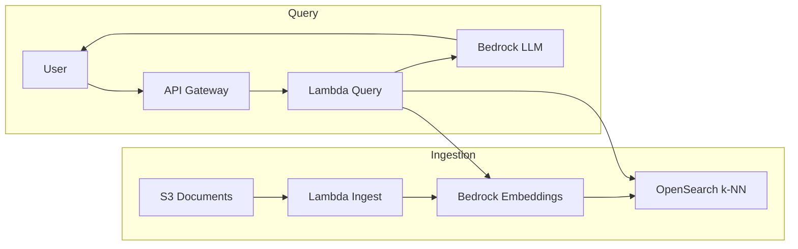

**Constraints:**
- Embedding dimension must match the OpenSearch k-NN index (e.g. 1536 for Titan v2)
- Lambda timeout must be ≥ embedding + LLM latency; set to at least 30s
- Chunk size and overlap directly affect retrieval quality

---

## Serverless REST API

**Keywords:** serverless, API, REST, HTTP endpoint, Lambda backend, microservice, CRUD, backend

**Core services:**
- Amazon API Gateway (HTTP or REST API): entry point, request routing, throttling
- AWS Lambda: business logic, one function per endpoint or domain
- Amazon DynamoDB: NoSQL storage, on-demand capacity for variable traffic
- Amazon Cognito: user authentication, JWT token validation
- Amazon SQS: decouples async work from synchronous API responses
- AWS Secrets Manager: stores API keys, DB credentials with automatic rotation
- AWS X-Ray: distributed tracing across Lambda and downstream calls
- Amazon CloudWatch: metrics, alarms, and structured logging

**Key flows:**

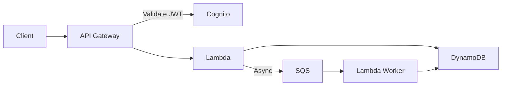

**Constraints:**
- API Gateway hard timeout: 29 seconds (cannot be extended)
- Lambda max execution: 15 minutes
- DynamoDB item size limit: 400 KB

**Anti-patterns:**
- Monolithic Lambda (all endpoints in one function — slows cold starts and deploys)
- Synchronous VPC calls from Lambda (ENI provisioning adds 10s+ cold start overhead)

---

## Data Pipeline / ETL

**Keywords:** ETL, data pipeline, data lake, ingestion, batch data, Glue, transformation, CDC, data engineering

**Core services:**
- Amazon Kinesis Data Streams: real-time event ingestion from producers
- Amazon Kinesis Firehose: managed delivery to S3, Redshift, or OpenSearch
- AWS Glue (ETL + Data Catalog): transforms data and catalogs schemas
- Amazon S3 (data lake): raw, processed, and curated zones
- Amazon Redshift (data warehouse): columnar storage for analytical queries
- Amazon Athena: serverless SQL queries directly on S3
- AWS Step Functions: orchestrates multi-step ETL workflows with error handling

**Key flows:**

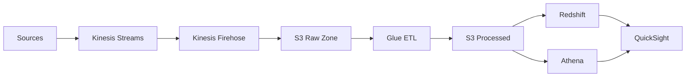

---

## Real-time Streaming Analytics

**Keywords:** real-time, streaming, live analytics, time-series, stream processing, Flink, windowed aggregation

**Core services:**
- Amazon Kinesis Data Streams: ordered, partitioned event stream
- Amazon Kinesis Data Analytics (Apache Flink): windowed stream processing, exactly-once semantics
- Amazon OpenSearch Service: real-time search and dashboards (Kibana)
- Amazon Timestream: purpose-built time-series database for metrics and IoT
- AWS Lambda: lightweight event processors and enrichment
- Amazon DynamoDB: low-latency state store for running aggregates
- Amazon CloudWatch: infrastructure metrics and alerting

**Key flows:**

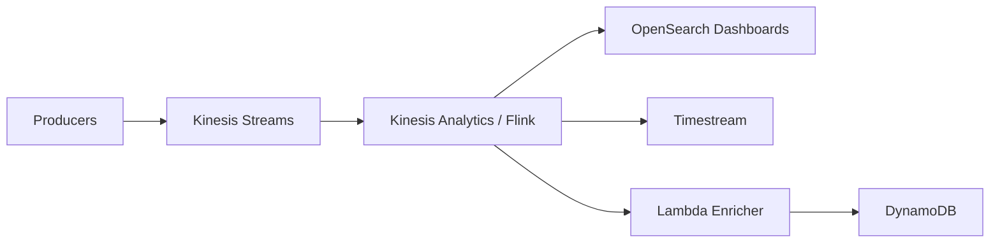

**Constraints:**
- Kinesis shard throughput: 1 MB/s write, 2 MB/s read per shard — plan capacity upfront
- Flink state backends require careful checkpoint configuration for exactly-once delivery

---

## ML Platform / MLOps

**Keywords:** ML, machine learning, model training, inference, SageMaker, deep learning, MLOps, model pipeline

**Core services:**
- Amazon SageMaker (Training + Endpoints): managed training, hyperparameter tuning, and model hosting
- Amazon ECR: container registry for custom training and inference images
- Amazon S3: stores training datasets, model artifacts, and evaluation results
- AWS Step Functions: ML pipeline orchestration (preprocess → train → evaluate → deploy)
- AWS CodePipeline: CI/CD for retraining triggers on new data
- Amazon EventBridge: event-driven triggers (e.g. new data in S3 → retrain)
- Amazon CloudWatch: tracks training metrics, endpoint latency, and invocation errors

**Key flows:**

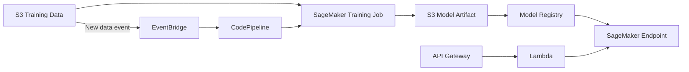

---

## Event-Driven Architecture

**Keywords:** event-driven, async, decoupled, pub/sub, fan-out, choreography, saga, workflow, event bus

**Core services:**
- Amazon EventBridge (event bus): routes events from AWS services, SaaS, or custom apps
- Amazon SQS (queues): decouples producers from consumers, buffers load spikes
- Amazon SNS (pub/sub): fan-out to multiple subscribers (SQS, Lambda, HTTP endpoints)
- AWS Lambda: event processors, small focused functions per event type
- AWS Step Functions: saga pattern, long-running workflows with compensation
- Amazon ECS / EKS: long-running consumers that can't fit in Lambda's 15-min limit
- Amazon DynamoDB: event store, idempotency keys, saga state

**Key flows:**

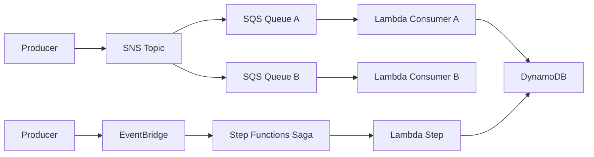

**Constraints:**
- SQS visibility timeout must be ≥ 6× the Lambda function timeout
- Always configure a Dead Letter Queue (DLQ) for failed message handling

**Anti-patterns:**
- Missing DLQ — failed events are silently dropped after max retries
- Tight coupling via synchronous calls between services defeats the decoupling goal

---

## Static Website / CDN

**Keywords:** static website, CDN, web hosting, SPA, frontend, React, Vue, Angular, CloudFront, static assets

**Core services:**
- Amazon CloudFront (CDN): global edge delivery, HTTPS termination, caching
- Amazon S3 (static assets): hosts HTML, CSS, JS, images — versioned deployments
- AWS Route 53 (DNS): latency-based or geolocation routing, health checks
- AWS Certificate Manager (ACM): free SSL/TLS certificates for CloudFront distributions
- AWS WAF: IP allow/block lists, rate limiting, managed rule groups
- AWS Lambda@Edge: request/response manipulation at edge (auth, redirects, A/B)
- Amazon Cognito (optional): user pools for authenticated SPAs

**Key flows:**

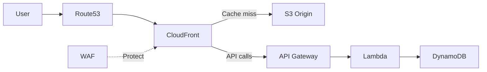

---

## IoT Platform

**Keywords:** IoT, devices, sensors, MQTT, telemetry, edge, Greengrass, connected devices, fleet management

**Core services:**
- AWS IoT Core: device gateway supporting MQTT, HTTP, WebSocket; rules engine
- Amazon Kinesis Data Streams: high-throughput telemetry ingestion from thousands of devices
- Amazon Timestream: time-series database optimized for IoT sensor data
- AWS Lambda: processes IoT rules, triggers alerts, transforms data
- Amazon DynamoDB: device shadow (last-known state), device registry
- Amazon SNS: alerts and notifications (threshold breaches, anomalies)
- AWS Greengrass: edge compute — runs Lambda and ML inference on-device

**Key flows:**

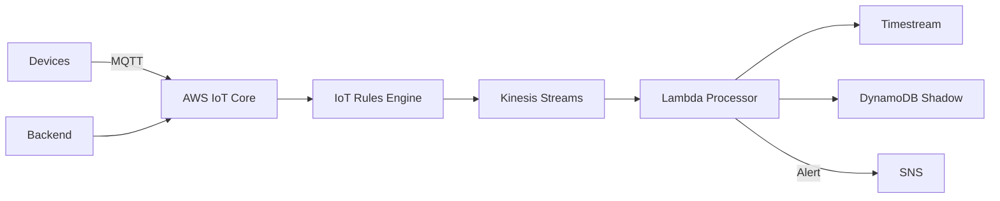

---

## Container Platform / Kubernetes

**Keywords:** containers, Kubernetes, EKS, microservices, Docker, Helm, service mesh, Istio, containerized

**Core services:**
- Amazon EKS (managed Kubernetes): control plane managed by AWS, node groups or Fargate
- Amazon ECR (container registry): stores and scans Docker images
- AWS ALB (Application Load Balancer): L7 routing, path-based rules, TLS termination
- Amazon RDS (relational DB): PostgreSQL or MySQL with Multi-AZ for persistence
- Amazon ElastiCache (Redis): session store, caching layer, pub/sub
- AWS Secrets Manager: injects secrets as environment variables or volumes
- Amazon CloudWatch + Container Insights: cluster, pod, and container metrics
- AWS Auto Scaling: horizontal pod autoscaler + cluster autoscaler

**Key flows:**

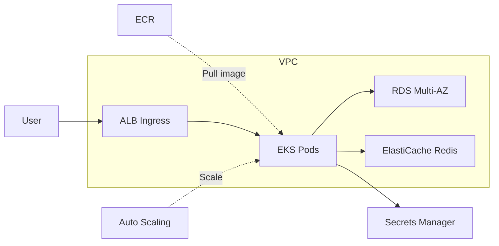

---

## Generative AI / LLM Application

**Keywords:** generative AI, chatbot, LLM, Bedrock, AI assistant, Claude, agent, conversational, foundation model

**Core services:**
- Amazon Bedrock (Foundation Models): Claude, Titan, Llama — managed LLM inference, no GPU ops
- Amazon API Gateway: HTTPS entry point with request throttling and API keys
- AWS Lambda: prompt engineering, retrieval orchestration, response post-processing
- Amazon DynamoDB: conversation history per session, idempotency, user profiles
- Amazon S3: document storage for context injection or fine-tuning datasets
- Amazon Cognito: user authentication, JWT tokens, user pool management
- Amazon CloudWatch: token usage metrics, latency, error rates per model

**Key flows:**

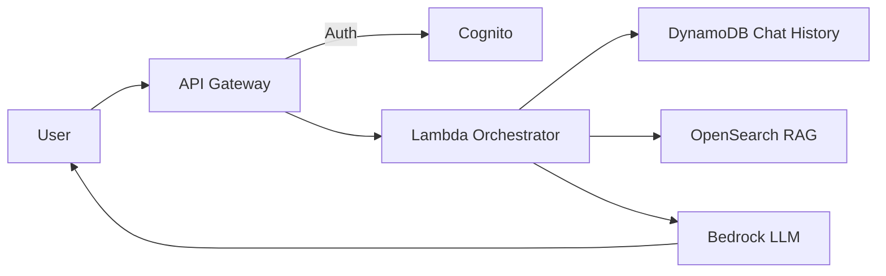

**Constraints:**
- Bedrock context window limits vary per model — design chunking strategy accordingly
- Lambda must be in the same region as the Bedrock model endpoint

---

## High Availability / Disaster Recovery

**Keywords:** disaster recovery, HA, high availability, multi-region, failover, resilience, DR, RTO, RPO

**Core services:**
- Amazon Route 53: health-check-based failover routing between regions
- AWS ALB (Application Load Balancer): distributes traffic across AZs, health checks
- Amazon RDS Multi-AZ: synchronous standby in a second AZ, automatic failover < 2 min
- Amazon S3 (Cross-Region Replication): async replication of objects to DR region
- AWS Auto Scaling: replaces unhealthy instances automatically
- Amazon CloudWatch (alarms + EventBridge): triggers failover Lambda automations
- AWS Backup: centralized backup across RDS, DynamoDB, EFS, EBS with retention policies

**Key flows:**

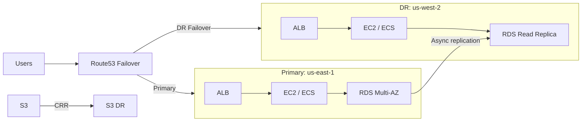

---

## Analytics / Data Warehouse

**Keywords:** analytics, BI, reporting, QuickSight, business intelligence, data warehouse, OLAP, dashboards

**Core services:**
- Amazon Redshift (data warehouse): columnar storage, massively parallel query execution
- AWS Glue (ETL + Catalog): transforms raw data, maintains schema catalog
- Amazon S3 (data lake): stores raw and processed data cheaply at scale
- Amazon Athena: serverless SQL on S3 — query without loading into Redshift
- Amazon QuickSight: managed BI dashboards with ML-powered insights (Q)
- AWS Lake Formation: fine-grained access control on the data lake
- Amazon CloudWatch: monitors Glue jobs, Redshift query performance

**Key flows:**

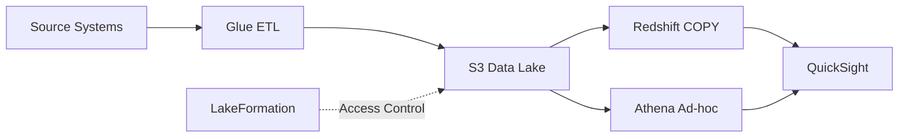

---

## Security & Compliance

**Keywords:** security, compliance, WAF, DDoS, GuardDuty, audit, SIEM, encryption, zero-trust, hardening

**Core services:**
- AWS WAF (Web Application Firewall): blocks OWASP Top 10, rate limiting, geo-blocking
- AWS Shield Standard/Advanced: automatic DDoS protection at L3/L4 (Standard is free)
- Amazon GuardDuty: ML-based threat detection on CloudTrail, VPC Flow Logs, DNS logs
- AWS Security Hub: aggregates findings from GuardDuty, Inspector, Macie into one view
- AWS KMS (Key Management Service): manages encryption keys for S3, RDS, EBS, Secrets
- AWS CloudTrail: immutable audit log of all API calls across the account
- AWS Config: tracks configuration changes and evaluates compliance rules

**Key flows:**

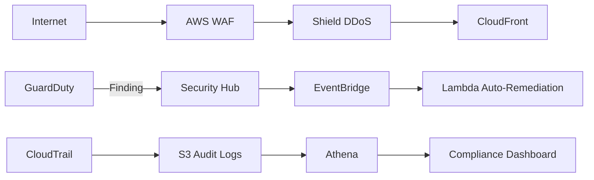
